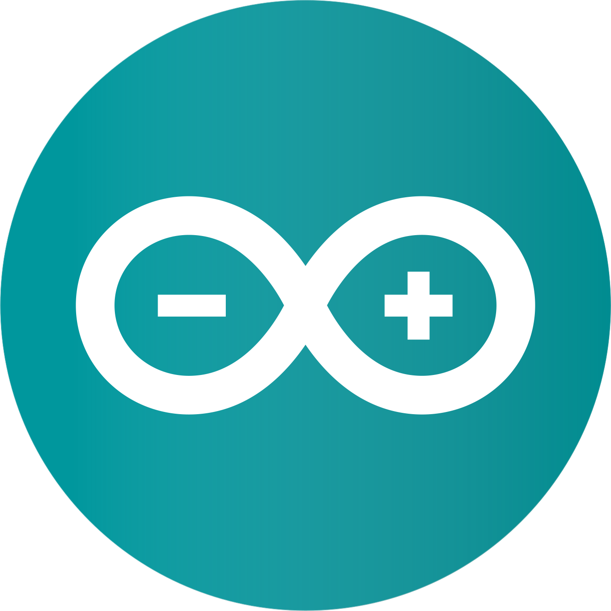
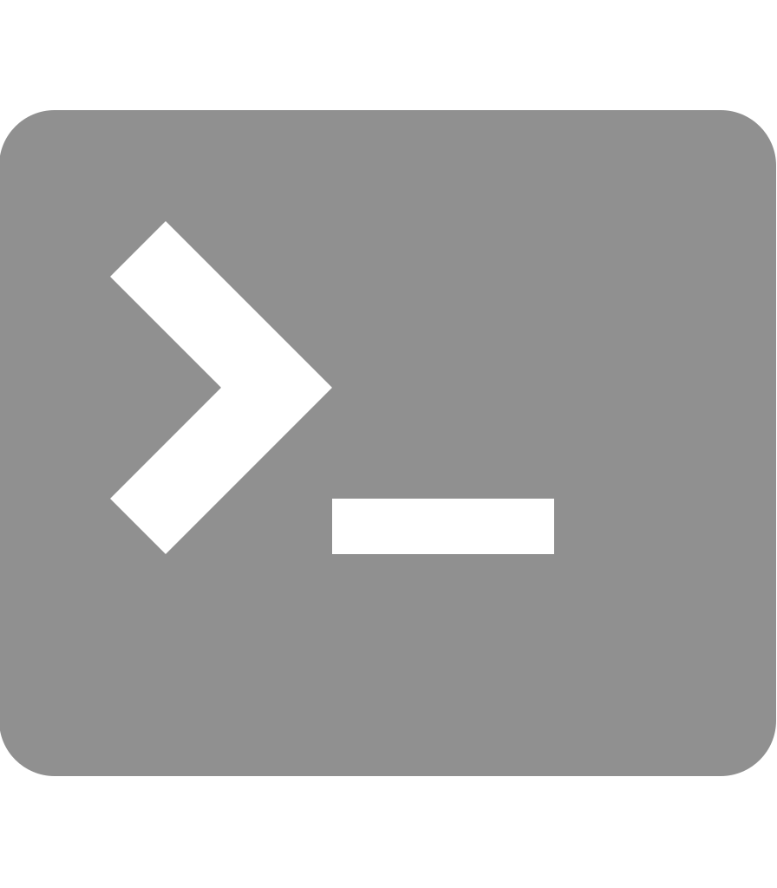

## 👋About Me
Student by day, developer by night. 
Terminal enthusiast and creator of random websites. 
A lone explorer in the wonderful world of technology and development.

## 📧Contact
If you have any project ideas, requests, or questions, don't hesitate to get in touch with me!

  
  <b><a href="https://discord.com/users/710569497081151590" target="_blank">Lemonyte#3674</a></b>

## ⭐Featured Projects
- [PyAutoTrace](https://github.com/lemonyte/pyautotrace)
- [Pyco](https://github.com/Duplexes/pyco)
- [Wastebin](https://github.com/lemonyte/wastebin)
- [Deta Status](https://github.com/lemonyte/deta-status)
- [Turtle Drawer](https://github.com/lemonyte/turtle-drawer)
- [Duplicate File Finder](https://github.com/lemonyte/dff)
- [Russian Roulette Discord Bot](https://github.com/lemonyte/russian-roulette-bot)
- [HTTP Waifus](https://github.com/lemonyte/http-waifus)
- [Picture Painter](https://github.com/lemonyte/picture-painter)
- [Terminal Snake](https://github.com/lemonyte/terminal-snake)
- [Pongout](https://github.com/lemonyte/pongout)
- [Stegosaurus](https://github.com/lemonyte/stegosaurus)
- [Coding Club CLI](https://github.com/ebus-coding-club/coding-club-cli)
- [DVD Screensaver](https://github.com/lemonyte/dvd-screensaver)
- [Password Generator](https://github.com/lemonyte/password-generator)
- [Mostly Harmless](https://github.com/lemonyte/mostly-harmless)
- [MLA Terminal](https://github.com/lemonyte/mla-terminal)

## 🔧Languages and Tools

  
  
  
  
  
  
  
  
  
  
  
  
  
  
  
  
  
  

## 🏆Certifications

## 📈Metrics

