# 👋 About Me

Hello fellow traveller! I'm **Lemonyte**, an open-sourcerer 🧙‍♂️ passionate about the world of software and technology.

- ❤️ I love [terminals](https://github.com/lemonyte/terminal-player) and making things that are [useful](https://github.com/lemonyte/ferry-planner) to others.
- 🧠 I'm always trying to expand my knowledge and skillset, so I'm learning Rust right now.
- 💡 I like to learn about anything that sparks my interest, like [web development](https://github.com/lemonyte/wastebin), [image vectorization](https://github.com/lemonyte/pyautotrace), [Discord bots](https://github.com/lemonyte/russian-roulette-bot), and [cryptography](https://github.com/lemonyte/stegosaurus).
- 🔥 I believe in writing structured, readable, maintainable code, and occasionally having some [fun](https://github.com/lemonyte/http-waifus).
- 🤝 I'm quite fond of open source and I'm always looking for ways to contribute and give back.
- 💭 I'm dreaming of a future where software and hardware exist in the hands of the people, for the people, and by the people, without technological limitations.

## 📧 Contact

If you have a project idea, request, question, or just want to chat, don't hesitate to get in touch with me!

  
  <b><a href="https://discord.com/users/710569497081151590" target="_blank">@lemonyte</a></b>

  
  <b><a href="https://matrix.to/#/@lemonyte:matrix.org" target="_blank">@lemonyte:matrix.org</a></b>

## ⭐ Featured Projects

These are some of my favorite projects that I've worked on.
A star or contribution is a great way to keep a solo developer motivated!

- [PyAutoTrace](https://github.com/lemonyte/pyautotrace)
- [Ferry Planner](https://github.com/lemonyte/ferry-planner)
- [Russian Roulette Discord Bot](https://github.com/lemonyte/russian-roulette-bot)
- [Wastebin](https://github.com/lemonyte/wastebin)
- [Pyco](https://github.com/Duplexes/pyco)
- [Turtle Drawer](https://github.com/lemonyte/turtle-drawer)
- [HTTP Waifus](https://github.com/lemonyte/http-waifus)
- [Duplicate File Finder](https://github.com/lemonyte/dff)
- [Picture Painter](https://github.com/lemonyte/picture-painter)
- [Terminal Snake](https://github.com/lemonyte/terminal-snake)
- [Pongout](https://github.com/lemonyte/pongout)
- [Stegosaurus](https://github.com/lemonyte/stegosaurus)
- [Coding Club CLI](https://github.com/ebus-coding-club/coding-club-cli)
- [DVD Screensaver](https://github.com/lemonyte/dvd-screensaver)
- [Mostly Harmless](https://github.com/lemonyte/mostly-harmless)

## 🛠️ Languages & Tools

  
  
  </a>
  
  
  
  
  
  
  
  
  
  
  
  
  
  
  

## 🏆 Certifications

## 📈 Metrics

