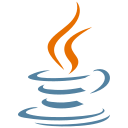

## 👋 About Me
> I've got too much time on my hands, and not enough projects.

I'm a student and teaching myself programming in my spare time. 
A lone explorer in the wonderful world of technology and development.

## 📧 Contact
If you have any project ideas, requests, or questions, don't hesitate to get in touch with me!

  
  <b>LemonPi#3674</b>

## ⭐ Featured Projects
- [Pyco](https://github.com/Duplexes/pyco)
- [Duplicate File Finder](https://github.com/LemonPi314/dff)
- [Stegosaurus](https://github.com/LemonPi314/stegosaurus)
- [YouTube Downloader](https://github.com/LemonPi314/youtube-downloader)
- [PyChat](https://github.com/Duplexes/PyChat)
- [Coding Club CLI](https://github.com/ebus-coding-club/coding-club-cli)
- [DVD Screensaver](https://github.com/LemonPi314/dvd-screensaver)
- [Password Generator](https://github.com/LemonPi314/password-generator)
- [Picture Painter](https://github.com/LemonPi314/picture-painter)
- [Russian Roulette Discord Bot](https://github.com/LemonPi314/russian-roulette-bot)
- [Mostly Harmless](https://github.com/LemonPi314/mostly-harmless)
- [MLA Terminal](https://github.com/LemonPi314/mla-terminal)

## 🔧 Languages and Tools

  
  
  
  
  
  
  
  
  
  
  
  
  
  
  
  
  
  
  

## 📈 GitHub Stats

